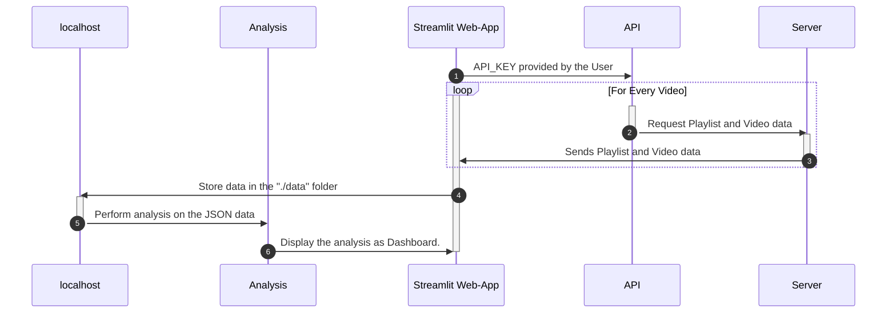
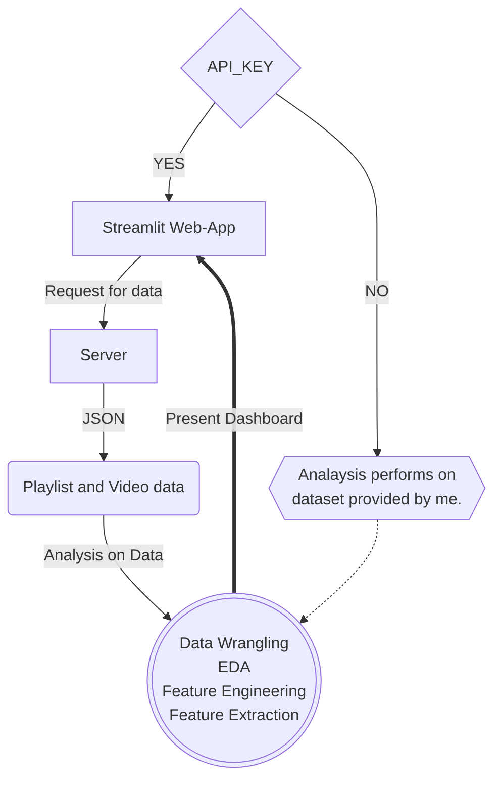

# CampusX DSMP

## Motivation

1. It is like a project. Due to this I can learn or improve some important topics like Youtube v3 API, EDA, etc.
2. I want to know all the topics covered in **DSMP**.
3. I want to know that which topics are completed by me.

## Process of Thinking

1. Need to get the Youtube videos description because it contains the _timestamps_ with chapter name. This can be done by **scrapping the website** (which is illegal for sure) or using **Youtube v3 API**.
2. Get the _timestamp and chapter name_ using **regex** and store it into list.
3. Perform EDA on the dataset and arrange the important topics.

## Web-App Working

### 🔖 With Sequence Diagram

### 🔖 Workflow with Flowchart

## Dataset

This dataset contains all the video present in Youtube playlist of **DSMP cousrse by CampusX**. In this dataset **1 video** not available because it is deleted from the Youtube (that's what youtube api says) `videoId = 'iOzA5Q_ZyFo'`.

> The course is running while performing this analysis.

- `videoId` is ID of Youtube video.

#### Info from API

- `addedToPlaylist` contains the datetime, when the is added the DSMP youtube playlist.
- `videoPublishedAt` contains the datetime referring when the video is published on Youtube.
- `categoryId` same for all videos `27`.
- `commentCount, viewCount, likeCount` _yeah toh pata he hoga_.
- `viewCount` of _paid videos_ are not provided by the Youtube API.
- `duration` of the video in **minutes**.

#### Info from Title of the Video

- `sessionName` refer to name of the session or video.
- `isPaid` referes to paid video as 1 and non-paid video as 0. `Category(0, 1)`
- `isSolutions` refers to **Task Solutions** video. `Category(0, 1)`
- `isSession` refers that video is a Free or Paid session of course. This course contains some other category of videos also like `'announcement videos', 'old videos'` etc. `Category(0, 1)`
- `taskNo` contains the `Task Number` from the title of the video.
- `sessionNo` contains the `Session Number` from the title of the video.

#### Info from Description of the Video

- `linkInVideo` contains a `list of URLs` present in the video's description.
- `videoTimeStamp` contains the timestamps provided in the decription.

### EDA on Data

Performing EDA is a must work to do on a dataset because due to this you will know your data, get insights from it and also perform other operaions like feature engineering, ML algo building, etc. on the data.

1. Get the sum of `likes, comments, views and duration` in category wise with features like `isSession, isPaid, isTask`
2. Remove the default links such as [CampusX website link](https://learnwith.campusx.in) or [Course playlist link](https://www.youtube.com/playlist?list=PLKnIA16_RmvbAlyx4_rdtR66B7EHX5k3z) from the `linkInVideo` column.
3. Also identify the module in which the course video comes like `[python, numpy, pandas, vizualization, sql]`.
